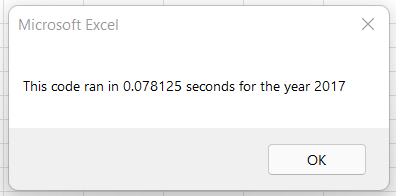

# 🚀 VBA_Challenge
Challenge Week2 Data Analysis BootCamp using VBA Excel
## ⚡Overview Of Project
Assist Steve with a market stock analysis over the last few years and determine the total volume and return for each ticker. Also, we need to refactor the code so the analysis can run faster by taking fewer steps and improving the logic. The tool that has been used for this analysis is VBA Excel.
## ⚡Results
The comparison of 2017 and 2018 stocks, show that ENPH is the best ticker investment because in 2017, had a return of 130% and continued to grow in 2018 with a return of 82%. In second place is RUN, with a 6% of return in 2017 and an 84% of return in 2018. These tickers are the ones who need to be considered for investment.
In 2017, DQ had the highest return with a 199% but in 2018 had a drop of -63%, which means that it’s not a good choice for investment. 

     

At first the original code scanned the entire column looking for just one ticker, it gave the results but there was room for optimization. In the second code, the number of iterations was drastically reduced so VBA was able to find all the tickers in a single scan speeding up the results from 0.7 seconds to 0.07.

  
 

## ⚡Summary
### 1.	What are the advantages or disadvantages of refactoring code?
One of the advantages is that you can realize if the code has unnecessary loops, redundant statements, or some errors. This helps the code run faster which is convenient with big datasets or quickly reports. Also, a smaller and smarter code is easier to read for another person. 
The disadvantages are that refactoring can take a lot of time which is complicated to have in tight deadlines. Also, changing the code can bring new bugs and complications.
### 2.	How do these pros and cons apply to refactoring the original VBA script?
The pros are that the new script was optimized by reducing the loops, which result in a faster run and cleaner code. The cons were that it took some time to make it work because I encountered with new bugs. 
